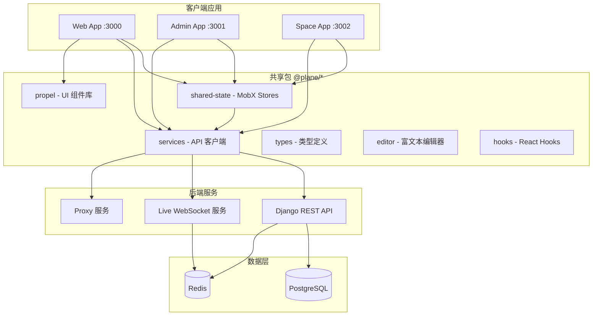
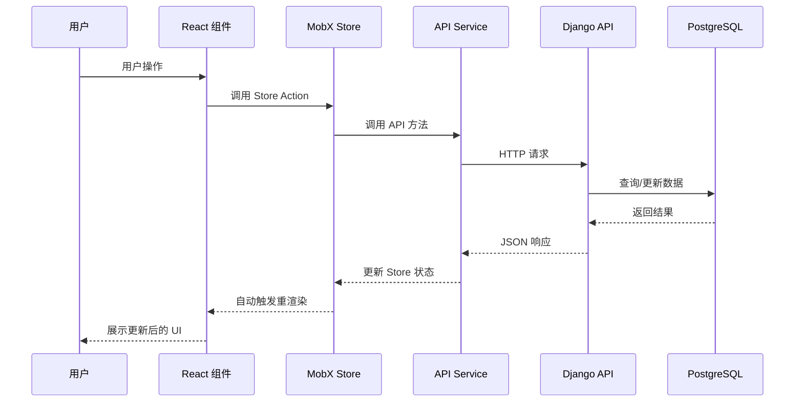
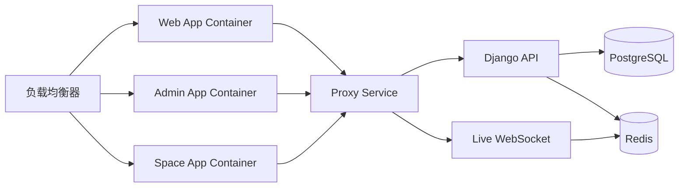

# Plane 项目管理平台架构设计

## 概述

Plane 是一个开源的项目管理平台，采用现代化的 monorepo 架构，提供灵活、可扩展的项目协作解决方案。本文档描述了 Plane 的整体架构设计，包括前端应用、后端 API、共享包以及它们之间的交互方式。

## 设计目标

- 🎯 **模块化设计**: 通过 monorepo 实现代码共享和模块化管理
- 🎯 **高性能**: 使用 MobX + SWR 实现高效的状态管理和数据缓存
- 🎯 **可扩展性**: 支持多租户、多工作空间的企业级扩展
- 🎯 **开发体验**: 统一的工具链和组件库，提升开发效率

## 架构原则

1. **单一数据源**: MobX stores 作为状态管理的唯一真相来源
2. **关注点分离**: 前端应用、共享包、后端服务明确分离
3. **渐进式增强**: 支持从开发环境到生产环境的平滑过渡

## 系统架构

### 整体架构图



### Monorepo 结构

Plane 采用 **pnpm workspace** 管理的 monorepo 架构，使用 **Turborepo** 进行任务编排。

```
plane/
├── apps/                    # 应用层
│   ├── web/                 # 主前端应用 (React Router 7)
│   ├── admin/               # 管理后台
│   ├── space/               # 公共分享空间
│   ├── api/                 # Django REST API
│   ├── live/                # WebSocket 实时协作服务
│   └── proxy/               # 代理服务
│
└── packages/                # 共享包
    ├── propel/              # 主 UI 组件库 (40+ 组件)
    ├── ui/                  # 补充 UI 组件
    ├── shared-state/        # MobX 状态管理
    ├── services/            # API 客户端层
    ├── types/               # TypeScript 类型 + Zod 校验
    ├── editor/              # TipTap 富文本编辑器
    ├── hooks/               # 共享 React Hooks
    ├── constants/           # 共享常量
    ├── i18n/                # 国际化
    ├── utils/               # 工具函数
    └── *-config/            # 共享工具配置
```

### 核心组件

#### 组件 1: 前端应用层 (Web/Admin/Space)

**职责:** 提供用户界面和交互体验

**技术栈:**
- React 18.3.1
- React Router 7.9.5 (文件系统路由)
- Vite 7.1.11 (构建工具)
- Tailwind CSS (样式)
- MobX 6.12.0 (状态管理)
- SWR 2.2.4 (数据获取和缓存)

**关键特性:**
- 文件系统路由: `app/(all)/[workspaceSlug]/...`
- 懒加载提供者: PostHog、Intercom 等分析工具
- 响应式设计和主题系统
- 多语言支持 (i18n)

#### 组件 2: 共享状态层 (@plane/shared-state)

**职责:** 集中管理应用状态，提供响应式数据流

**技术栈:** MobX 6.12.0

**关键特性:**
- MobX stores 作为单一数据源
- 自动依赖跟踪和组件重渲染
- 支持异步操作和乐观更新
- 通过 StoreProvider 注入到 React 组件树

#### 组件 3: API 服务层 (@plane/services)

**职责:** 封装所有后端 API 调用，提供统一的数据访问接口

**技术栈:** Axios

**关键特性:**
- RESTful API 客户端
- 请求拦截器和错误处理
- 自动携带认证凭证
- 类型安全的 API 调用

#### 组件 4: UI 组件库 (@plane/propel + @plane/ui)

**职责:** 提供可复用的 UI 组件，确保设计一致性

**技术栈:** React + Tailwind CSS

**关键特性:**
- 40+ 标准化 UI 组件
- 支持主题定制
- 完整的 TypeScript 类型支持
- 跨应用共享和复用

#### 组件 5: Django REST API

**职责:** 处理业务逻辑、数据持久化、认证授权

**技术栈:**
- Django REST Framework
- PostgreSQL v14+
- Celery (后台任务)
- Redis v6.2.7+ (缓存和任务队列)

**关键特性:**
- 34 个核心模型 (Issue, Project, User, Workspace, Cycle, Module 等)
- OAuth + JWT 认证
- 细粒度权限控制
- 后台任务处理 (Celery)

## 数据流

### 数据流图



### 关键流程说明

#### 流程 1: 前端数据获取

1. **组件挂载**: React 组件通过 `useStore()` 访问 MobX Store
2. **触发请求**: 组件调用 Store 的 action 方法
3. **API 调用**: Store 通过 `@plane/services` 发起 HTTP 请求
4. **缓存层**: SWR 提供请求缓存和自动重新验证
5. **状态更新**: API 响应后更新 MobX Store
6. **响应式更新**: MobX 自动通知订阅的组件重新渲染

#### 流程 2: 实时协作

1. **WebSocket 连接**: 客户端连接到 Live 服务
2. **事件广播**: 用户操作通过 WebSocket 广播到其他客户端
3. **乐观更新**: 本地先更新 UI，后同步到服务器
4. **冲突解决**: 服务端处理并发冲突

## 技术选型

| 技术领域 | 选型 | 理由 |
|---------|------|------|
| 前端框架 | React 18.3.1 | 成熟的生态、优秀的性能、广泛的社区支持 |
| 路由 | React Router 7.9.5 | 文件系统路由、服务端渲染支持、从 Next.js 迁移 |
| 状态管理 | MobX 6.12.0 | 简单直观、自动依赖跟踪、适合复杂状态管理 |
| 数据获取 | SWR 2.2.4 | 自动缓存、请求去重、后台重新验证 |
| 构建工具 | Vite 7.1.11 | 极快的 HMR、优化的生产构建 |
| 后端框架 | Django REST | 成熟的 Python 框架、丰富的插件生态 |
| 数据库 | PostgreSQL v14+ | 可靠性、ACID 支持、丰富的数据类型 |
| 缓存/队列 | Redis v6.2.7+ | 高性能、支持多种数据结构 |
| Monorepo | pnpm + Turbo | 高效的依赖管理、增量构建、任务并行 |
| UI 框架 | Tailwind CSS | 实用优先、高度可定制、优秀的开发体验 |

## 部署架构

### 部署拓扑



### 环境说明

- **开发环境**: Docker Compose 本地开发，18 个并发开发服务器
- **测试环境**: 独立的数据库和 Redis 实例
- **生产环境**: 容器化部署，支持水平扩展

### 端口分配

| 服务 | 端口 | 说明 |
|-----|------|------|
| Web App | 3000 | 主前端应用 |
| Admin App | 3001 | 管理后台 (/god-mode/) |
| Space App | 3002 | 公共分享空间 |
| Django API | 8000 | REST API 服务 |
| PostgreSQL | 5432 | 数据库 |
| Redis | 6379 | 缓存和消息队列 |

## 性能考虑

### 性能指标

| 指标 | 目标值 | 备注 |
|------|--------|------|
| 首屏加载时间 | < 2s | Vite 优化 + 代码分割 |
| API 响应时间 | < 200ms | 数据库索引 + Redis 缓存 |
| 并发用户数 | > 1000 | 水平扩展 + 负载均衡 |
| 内存占用 | > 12GB (开发) | Monorepo 开发环境最低要求 |

### 优化策略

1. **缓存策略**:
   - SWR 客户端缓存和自动重新验证
   - Redis 服务端缓存热点数据
   - PostgreSQL 查询结果缓存

2. **代码分割**:
   - React Router 路由级别懒加载
   - 动态 import 第三方库 (PostHog, Intercom)
   - Vite 自动分块优化

3. **构建优化**:
   - Turbo 增量构建和任务缓存
   - tsdown 代替 tsc 提升构建速度
   - pnpm 高效的依赖管理

## 安全设计

### 安全措施

- 🔒 **认证方式**: OAuth 2.0 + JWT Token
- 🔒 **授权机制**: Django REST Framework 细粒度权限控制
- 🔒 **数据加密**: HTTPS 传输加密，数据库敏感字段加密
- 🔒 **审计日志**: 记录关键操作和数据变更

### 安全边界

- 前端应用不直接访问数据库，所有请求通过 API 网关
- API 层实施认证和授权检查
- 数据库层配置访问白名单
- Redis 仅内网访问

## 扩展性设计

### 水平扩展

- **前端应用**: 无状态设计，支持多实例部署
- **API 服务**: 通过负载均衡器分发请求到多个 API 实例
- **数据库**: 读写分离 + 主从复制
- **缓存**: Redis Cluster 集群模式

### 垂直扩展

- 增加单个服务器的 CPU 和内存资源
- PostgreSQL 配置优化 (连接池、查询缓存)
- Celery worker 数量调整

## 监控与运维

### 监控指标

- 📊 **系统指标**: CPU、内存、磁盘、网络
- 📊 **应用指标**: 请求量、响应时间、错误率
- 📊 **业务指标**: 用户活跃度、项目创建数、任务完成率

### 工具集成

- **PostHog**: 产品分析和用户行为追踪
- **Intercom**: 用户反馈和支持
- **Sentry** (推荐): 错误追踪和性能监控

## 已知限制

1. **内存要求**: 开发环境需要至少 12GB RAM，8GB 可能导致构建失败
2. **构建时间**: Monorepo 全量构建耗时较长，建议使用 Turbo 增量构建
3. **迁移兼容**: 从 Next.js 迁移到 React Router 7，部分兼容 shim 存在于 `app/compat/next/`

## 未来规划

### 短期计划 (1-3 个月)

- [ ] 完成 Next.js 到 React Router 7 的迁移
- [ ] 优化开发环境启动速度
- [ ] 增强类型安全 (Zod 校验扩展)

### 长期规划 (6-12 个月)

- [ ] 微前端架构探索 (Module Federation)
- [ ] GraphQL API 支持
- [ ] 离线优先架构 (PWA)
- [ ] 自动化端到端测试覆盖

## 决策记录

### 决策 1: 从 Next.js 迁移到 React Router 7

- **日期**: 2024-Q4
- **背景**: Next.js 的服务端渲染特性与项目需求不完全匹配，路由灵活性受限
- **决策**: 迁移到 React Router 7，采用文件系统路由
- **理由**: 更灵活的路由控制、更好的客户端性能、减少服务端依赖
- **影响**: 需要维护兼容性 shim，逐步替换 Next.js 特定 API

### 决策 2: 采用 MobX 作为状态管理方案

- **日期**: 项目初期
- **背景**: 需要处理复杂的嵌套状态和大量异步操作
- **决策**: 选择 MobX 而非 Redux
- **理由**: 简化状态管理代码、自动依赖跟踪、更好的开发体验
- **影响**: 团队需要学习 MobX 的响应式编程模式

### 决策 3: Monorepo 架构

- **日期**: 项目初期
- **背景**: 多个前端应用需要共享代码和组件
- **决策**: 采用 pnpm workspace + Turborepo 管理 monorepo
- **理由**: 代码复用、统一工具链、更好的依赖管理
- **影响**: 构建复杂度增加，需要更高的机器配置

## 相关文档

- [部署指南](19_repo_doc_ref/plane/03-guides/deployment/deployment-guide.md)
- [开发环境搭建](../01-getting-started/setup-guide.md)
- [API 接口文档](../05-reference/api/api-reference.md)

## 更新历史

| 版本 | 日期 | 更新内容 | 作者 |
|------|------|---------|------|
| 1.0.0 | 2025-12-30 | 初始版本 | Terry Chen |
