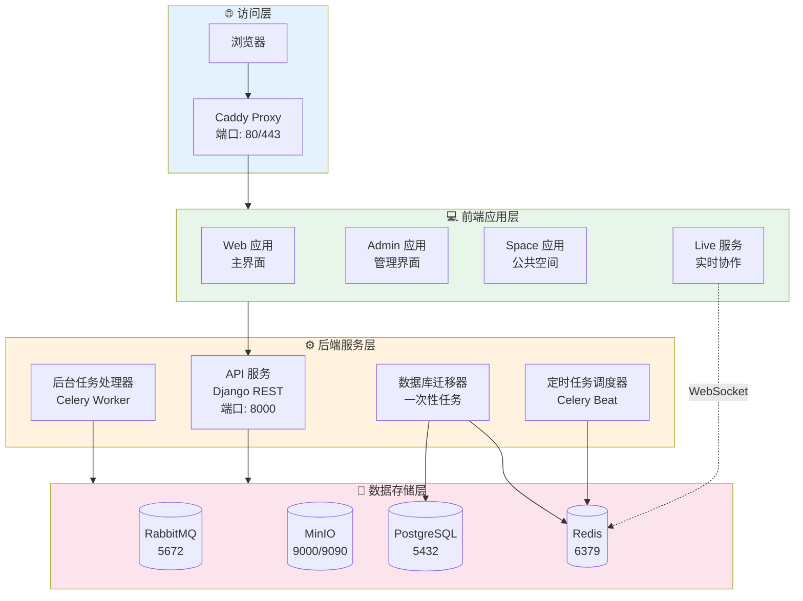
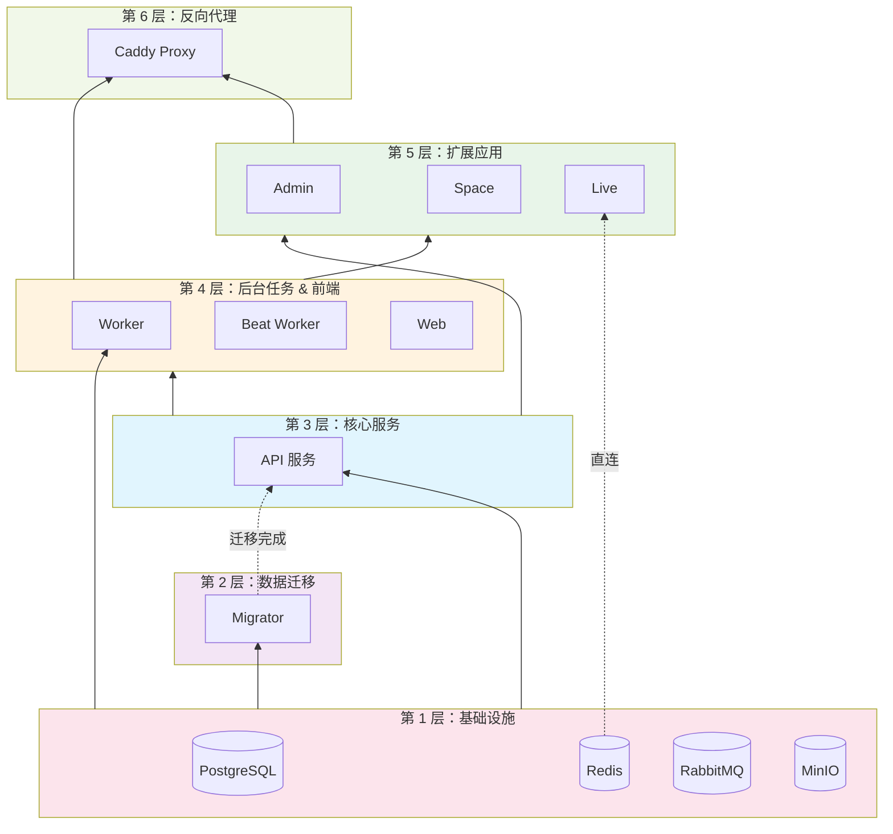
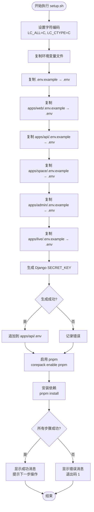
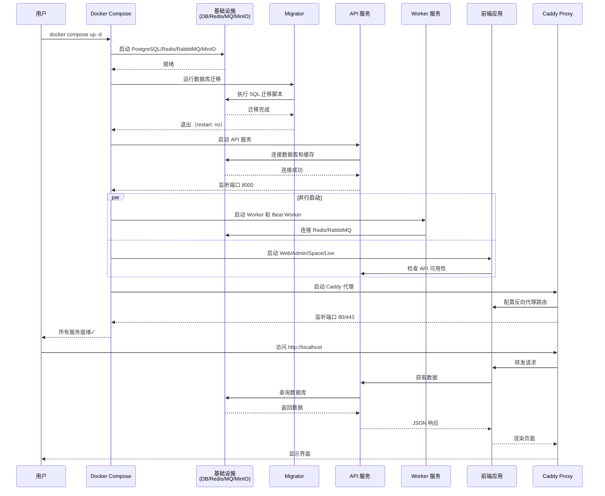
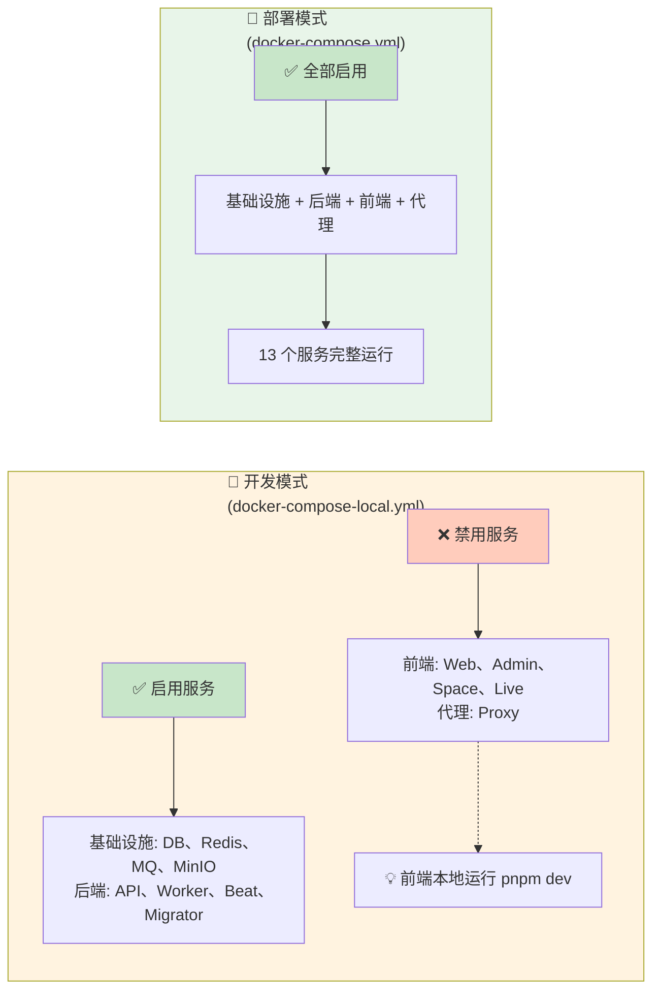
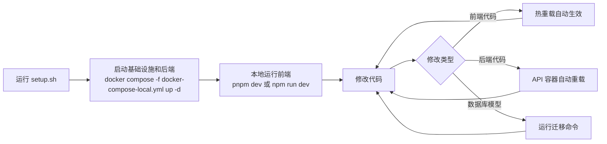
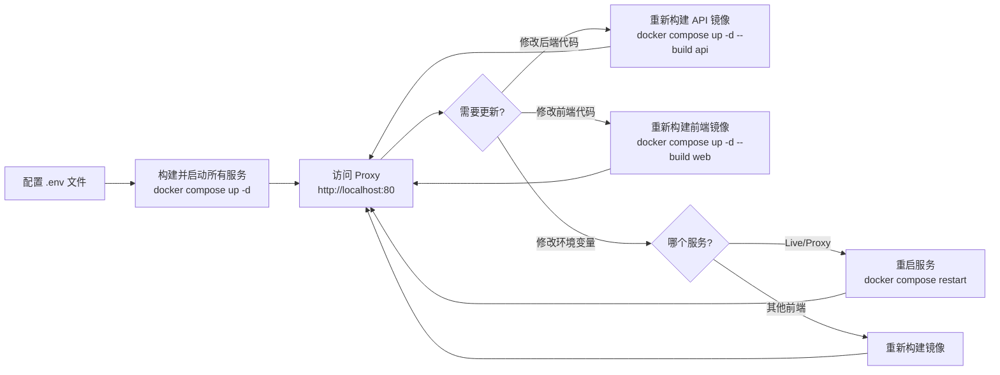
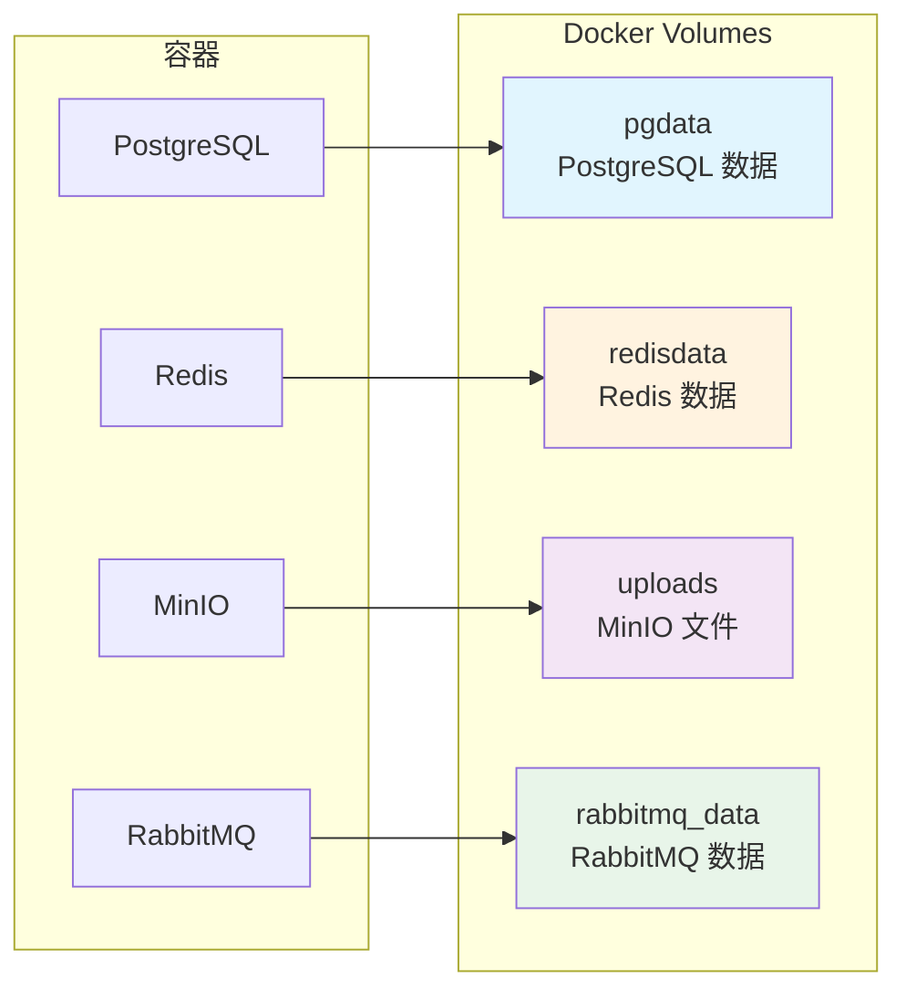
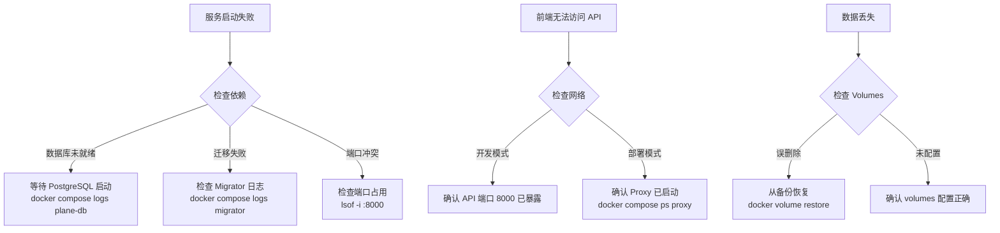

# Plane 核心组件架构

本文档详细说明了 Plane 项目的核心组件、外部依赖以及系统的初始化和运行机制，并对比了开发模式和生产部署模式之间的差异。

---

## 1. 系统架构概览

Plane 是一个分布式项目管理系统，采用微服务架构，由多个前端应用、后端 API 服务、异步任务处理器和多个基础设施组件组成。



---

## 2. 核心组件详解

### 2.1 前端应用组件

| 组件      | 职责                                        | 技术栈        | 依赖服务   |
| --------- | ------------------------------------------- | ------------- | ---------- |
| **Web**   | 主要用户界面，提供项目管理核心功能          | Next.js/React | API        |
| **Admin** | 系统管理界面，处理系统配置和用户管理        | Next.js/React | API、Web   |
| **Space** | 公共空间界面，面向外部用户的只读视图        | Next.js/React | API、Web   |
| **Live**  | 实时协作服务，处理 WebSocket 连接和实时更新 | Node.js       | API、Redis |

> [!NOTE]
> 前端应用的环境变量在构建时被烘焙到静态文件中，修改环境变量后需要重新构建镜像才能生效。仅 Live 服务支持运行时环境变量。

### 2.2 后端服务组件

| 组件            | 职责                                  | 启动命令                        | 依赖服务                    |
| --------------- | ------------------------------------- | ------------------------------- | --------------------------- |
| **API**         | REST API 服务，处理所有 HTTP 请求     | `docker-entrypoint-api.sh`      | PostgreSQL、Redis、RabbitMQ |
| **Worker**      | 异步任务处理器，执行后台任务          | `docker-entrypoint-worker.sh`   | API、PostgreSQL、Redis      |
| **Beat Worker** | 定时任务调度器，按计划触发任务        | `docker-entrypoint-beat.sh`     | API、PostgreSQL、Redis      |
| **Migrator**    | 数据库迁移工具，初始化/更新数据库结构 | `docker-entrypoint-migrator.sh` | PostgreSQL、Redis           |

### 2.3 基础设施组件

| 组件             | 镜像                                | 职责                              | 数据持久化             |
| ---------------- | ----------------------------------- | --------------------------------- | ---------------------- |
| **PostgreSQL**   | `postgres:15.7-alpine`              | 主数据库，存储所有业务数据        | `pgdata` volume        |
| **Valkey/Redis** | `valkey/valkey:7.2.11-alpine`       | 缓存、会话存储、Celery 消息队列   | `redisdata` volume     |
| **RabbitMQ**     | `rabbitmq:3.13.6-management-alpine` | 消息队列，处理异步任务            | `rabbitmq_data` volume |
| **MinIO**        | `minio/minio`                       | S3 兼容的对象存储，存储文件和附件 | `uploads` volume       |
| **Proxy**        | Caddy 2.10.0                        | 反向代理，路由请求到各个前端服务  | 无                     |

> [!IMPORTANT]
> PostgreSQL 配置了 `max_connections=1000` 以支持大量并发连接。

---

## 3. 组件依赖关系



**关键依赖说明：**

1. **基础设施优先**：数据库和缓存必须首先启动
2. **数据库迁移**：在 API 启动前完成数据库结构初始化
3. **API 核心**：所有前端应用和后台任务都依赖 API
4. **前端间依赖**：Admin 和 Space 依赖 Web（可能共享组件或路由）
5. **代理最后**：Proxy 需要等待所有服务就绪后才能启动

---

## 4. 项目初始化流程

### 4.1 初始化脚本（setup.sh）

`setup.sh` 脚本负责本地开发环境的初始化，执行以下步骤：



**关键步骤：**

1. **环境文件准备**：复制所有 `.env.example` 文件为 `.env`
2. **密钥生成**：为 Django 生成 50 字符的随机 `SECRET_KEY`
3. **依赖安装**：使用 pnpm 安装 Node.js 依赖

### 4.2 系统启动流程



---

## 5. 开发模式 vs 部署模式

### 5.1 配置文件对比

| 对比维度     | 开发模式                   | 部署模式             |
| ------------ | -------------------------- | -------------------- |
| **配置文件** | `docker-compose-local.yml` | `docker-compose.yml` |
| **目标用户** | 开发人员                   | 生产环境/最终用户    |
| **优化重点** | 快速迭代、调试便利         | 性能、稳定性、安全性 |

### 5.2 组件启用对比



> [!WARNING]
> 开发模式下，前端应用（Web/Admin/Space/Live）和 Proxy 默认被注释掉，需要手动取消注释或在本地直接运行。

### 5.3 详细差异对比

#### 基础设施组件

| 组件           | 开发模式                                                           | 部署模式                                 | 主要差异                      |
| -------------- | ------------------------------------------------------------------ | ---------------------------------------- | ----------------------------- |
| **PostgreSQL** | 端口暴露: `5432:5432`                                              | 端口未暴露（仅内部访问）                 | 开发模式允许本地工具直接连接  |
| **Redis**      | 端口暴露: `6379:6379`                                              | 端口未暴露                               | 开发模式便于调试缓存          |
| **RabbitMQ**   | 端口未暴露                                                         | 端口未暴露                               | 一致                          |
| **MinIO**      | 端口暴露: `9000:9000`, `9090:9090`<br/>复杂启动脚本（创建 bucket） | 端口未暴露<br/>简单命令 `server /export` | 开发模式便于访问 MinIO 控制台 |

#### 后端服务

| 组件            | 开发模式                                                                                                                         | 部署模式                                                                                                         | 主要差异                         |
| --------------- | -------------------------------------------------------------------------------------------------------------------------------- | ---------------------------------------------------------------------------------------------------------------- | -------------------------------- |
| **API**         | Dockerfile: `Dockerfile.dev`<br/>Volume: `./apps/api:/code`<br/>端口暴露: `8000:8000`<br/>命令: `docker-entrypoint-api-local.sh` | Dockerfile: `Dockerfile.api`<br/>无 Volume（代码构建到镜像）<br/>端口未暴露<br/>命令: `docker-entrypoint-api.sh` | 开发模式挂载本地代码，支持热重载 |
| **Worker**      | 同 API，挂载本地代码                                                                                                             | 代码构建到镜像                                                                                                   | 同上                             |
| **Beat Worker** | 同 API，挂载本地代码                                                                                                             | 代码构建到镜像                                                                                                   | 同上                             |
| **Migrator**    | 挂载本地代码<br/>命令参数: `--settings=plane.settings.local`                                                                     | 代码构建到镜像<br/>使用默认 settings                                                                             | 开发模式使用本地配置             |

#### 前端应用

| 组件      | 开发模式                                                                  | 部署模式                                                  |
| --------- | ------------------------------------------------------------------------- | --------------------------------------------------------- |
| **Web**   | ❌ 注释掉（需手动启用）<br/>Dockerfile: `Dockerfile.dev`<br/>挂载本地代码 | ✅ 启用<br/>Dockerfile: `Dockerfile.web`<br/>构建静态资源 |
| **Admin** | ❌ 注释掉                                                                 | ✅ 启用                                                   |
| **Space** | ❌ 注释掉                                                                 | ✅ 启用                                                   |
| **Live**  | ❌ 注释掉                                                                 | ✅ 启用<br/>显式配置内部服务地址                          |
| **Proxy** | ❌ 注释掉                                                                 | ✅ 启用<br/>暴露端口 80/443                               |

#### 容器配置

| 配置项       | 开发模式         | 部署模式                    | 原因                       |
| ------------ | ---------------- | --------------------------- | -------------------------- |
| **容器名称** | 无（自动生成）   | 显式指定（如 `api`, `web`） | 生产环境便于管理和监控     |
| **重启策略** | `unless-stopped` | `always`                    | 生产环境需要更强的自愈能力 |
| **网络**     | `dev_env`        | 默认网络（未显式指定）      | 开发模式隔离网络           |

### 5.4 典型工作流

#### 开发模式工作流



#### 部署模式工作流



---

## 6. 端口映射和访问

### 6.1 开发模式端口

| 服务          | 内部端口 | 外部端口 | 访问地址                | 用途           |
| ------------- | -------- | -------- | ----------------------- | -------------- |
| PostgreSQL    | 5432     | 5432     | `localhost:5432`        | 数据库连接     |
| Redis         | 6379     | 6379     | `localhost:6379`        | 缓存调试       |
| MinIO         | 9000     | 9000     | `http://localhost:9000` | 对象存储 API   |
| MinIO Console | 9090     | 9090     | `http://localhost:9090` | MinIO 管理界面 |
| API           | 8000     | 8000     | `http://localhost:8000` | REST API       |
| Web           | 3000     | -        | 本地运行                | 主界面         |
| Admin         | 3000     | -        | 本地运行                | 管理界面       |
| Space         | 3000     | -        | 本地运行                | 公共空间       |
| Live          | 3000     | -        | 本地运行                | 实时服务       |

> [!TIP]
> 开发模式下，前端应用通常在本地运行（使用 `pnpm dev`），并配置代理指向 `http://localhost:8000/api`。

### 6.2 部署模式端口

| 服务  | 内部端口 | 外部端口 | 访问地址           | 用途     |
| ----- | -------- | -------- | ------------------ | -------- |
| Proxy | 80/443   | 80/443   | `http://localhost` | 统一入口 |

> [!NOTE]
> 部署模式下，只有 Proxy 暴露端口，所有服务通过 Proxy 路由访问，增强了安全性。

---

## 7. 数据持久化

所有模式下都使用 Docker Volume 持久化数据：



**持久化路径：**

- `pgdata` → `/var/lib/postgresql/data`
- `redisdata` → `/data`
- `uploads` → `/export`（MinIO）
- `rabbitmq_data` → `/var/lib/rabbitmq`

---

## 8. 环境变量管理

### 8.1 环境变量文件结构

```
.
├── .env                      # 根配置（基础设施）
└── apps/
    ├── api/.env              # API 服务配置
    ├── web/.env              # Web 应用配置
    ├── admin/.env            # Admin 应用配置
    ├── space/.env            # Space 应用配置
    └── live/.env             # Live 服务配置
```

### 8.2 关键环境变量

| 类别          | 变量名                                                                              | 用途             | 配置文件         |
| ------------- | ----------------------------------------------------------------------------------- | ---------------- | ---------------- |
| **数据库**    | `POSTGRES_USER`<br/>`POSTGRES_DB`<br/>`POSTGRES_PASSWORD`                           | PostgreSQL 认证  | `.env`           |
| **消息队列**  | `RABBITMQ_USER`<br/>`RABBITMQ_PASSWORD`<br/>`RABBITMQ_VHOST`                        | RabbitMQ 认证    | `.env`           |
| **对象存储**  | `AWS_ACCESS_KEY_ID`<br/>`AWS_SECRET_ACCESS_KEY`<br/>`AWS_S3_BUCKET_NAME`            | MinIO 认证和配置 | `.env`           |
| **Django**    | `SECRET_KEY`                                                                        | 会话加密         | `apps/api/.env`  |
| **Live 服务** | `LIVE_SERVER_SECRET_KEY`<br/>`API_BASE_URL`<br/>`REDIS_URL`                         | 实时协作配置     | `apps/live/.env` |
| **代理**      | `LISTEN_HTTP_PORT`<br/>`LISTEN_HTTPS_PORT`<br/>`FILE_SIZE_LIMIT`<br/>`SITE_ADDRESS` | Caddy 配置       | `.env`           |

> [!CAUTION]
> 前端应用（Web/Admin/Space）的环境变量在**构建时**烘焙到静态文件中，修改后必须重新构建镜像。仅 Live 服务和 Proxy 支持运行时环境变量。

---

## 9. 最佳实践建议

### 9.1 开发环境

1. **使用热重载**：挂载本地代码目录以支持实时修改
2. **暴露必要端口**：便于使用数据库客户端、Redis 工具等调试
3. **本地运行前端**：获得更好的开发体验（热重载、调试工具）
4. **定期清理**：使用 `docker compose down -v` 清理 volumes（谨慎使用）

### 9.2 生产环境

1. **最小权限原则**：只暴露 Proxy 端口，其他服务仅内部访问
2. **健康检查**：添加 `healthcheck` 配置确保服务可用性
3. **资源限制**：配置 `deploy.resources` 限制容器资源使用
4. **日志管理**：配置日志驱动和日志轮转
5. **备份策略**：定期备份 Docker volumes（尤其是 `pgdata`）

### 9.3 环境变量管理

1. **不要提交 .env**：将 `.env` 添加到 `.gitignore`
2. **使用强密码**：生产环境使用强随机密码
3. **定期轮换**：定期更新 `SECRET_KEY` 等敏感密钥
4. **环境隔离**：为开发、测试、生产使用不同的配置

---

## 10. 故障排查

### 10.1 常见问题



### 10.2 诊断命令

```bash
# 查看所有服务状态
docker compose ps

# 查看特定服务日志
docker compose logs -f api

# 进入容器调试
docker compose exec api bash

# 检查网络连接
docker compose exec api ping plane-db

# 查看 volumes
docker volume ls
docker volume inspect plane_pgdata

# 重启单个服务
docker compose restart api

# 重新构建并启动
docker compose up -d --build api
```

---

## 11. 总结

### 11.1 架构特点

- **微服务架构**：前后端分离，服务解耦
- **容器化部署**：统一的运行环境，便于部署和扩展
- **异步任务处理**：使用 Celery 处理耗时任务，提升用户体验
- **双模式支持**：同时支持开发和生产场景

### 11.2 核心设计理念

| 设计原则       | 实现方式                                         |
| -------------- | ------------------------------------------------ |
| **关注点分离** | 前端、后端、任务处理器、基础设施独立部署         |
| **依赖管理**   | 通过 `depends_on` 控制启动顺序                   |
| **数据持久化** | 使用 Docker volumes 持久化关键数据               |
| **环境隔离**   | 开发和生产使用不同的 docker-compose 配置         |
| **安全性**     | 生产模式仅暴露必要端口，使用环境变量管理敏感信息 |

### 11.3 快速启动指南

```bash
# 1. 初始化环境
./setup.sh

# 2a. 启动开发环境（仅后端和基础设施）
docker compose -f docker-compose-local.yml up -d
# 本地运行前端
cd apps/web && pnpm dev

# 2b. 启动生产环境（完整系统）
docker compose up -d
# 访问 http://localhost

# 3. 查看日志
docker compose logs -f

# 4. 停止服务
docker compose down
```

---

## 附录：相关资源

- **项目仓库**：[https://github.com/makeplane/plane](https://github.com/makeplane/plane)
- **Docker Compose 文档**：[https://docs.docker.com/compose/](https://docs.docker.com/compose/)
- **Django 文档**：[https://docs.djangoproject.com/](https://docs.djangoproject.com/)
- **Celery 文档**：[https://docs.celeryproject.org/](https://docs.celeryproject.org/)
