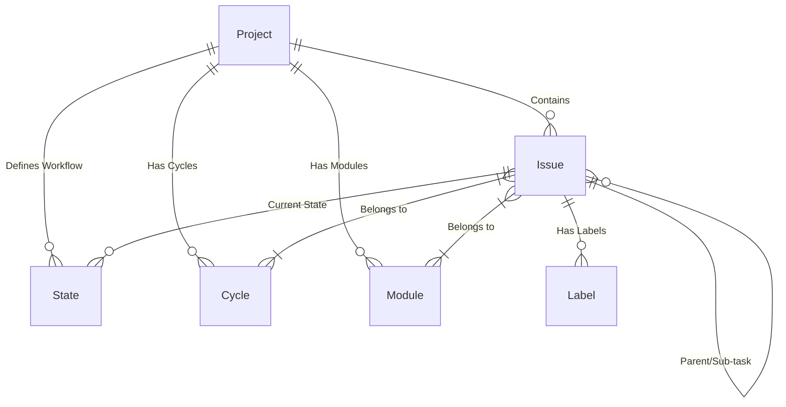
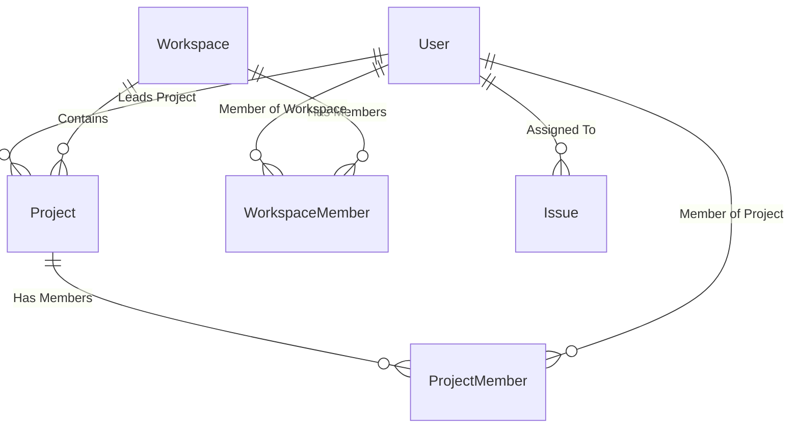
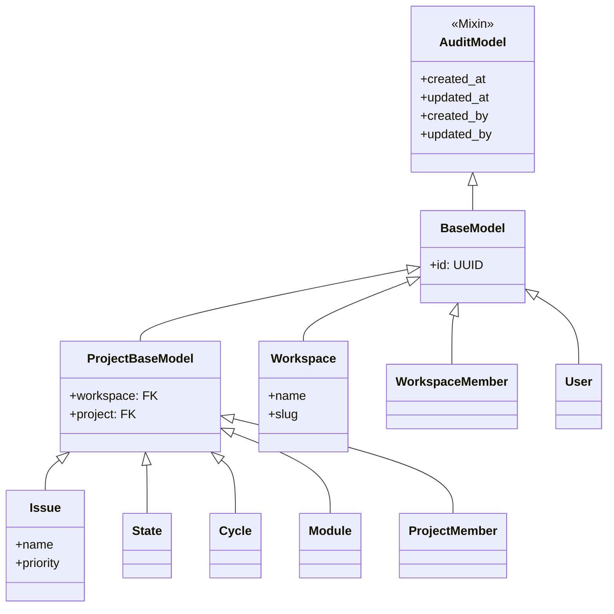

# Plane 核心数据模型分析笔记

本技术笔记旨在帮助开发者快速掌握 Plane (基于 Django) 的核心数据结构与实体关系。

## 1. 核心实体关系图 (ER Diagram)

为了更清晰地展示数据模型，我们将关系图分为两部分：**项目内部关系**和**全局外部关系**。

### 1.1 Project 内部核心关系 (Project Scope)

此图展示了 Project 内部的核心业务对象关系。所有这些对象都继承自 `ProjectBaseModel`，这意味着它们都自动归属于特定的 Project 和 Workspace，天然具备多租户隔离特性。

- **核心聚合**: `Project` 作为核心聚合根，管理着所有的 `Issue`。
- **任务组织**: `Issue` 通过 `Cycle` (时间维度) 和 `Module` (功能维度) 进行组织。
- **状态流转**: `Issue` 必须关联一个 `State`，状态本身也定义在 Project 级别。

### 1.2 全局与外部关系 (Global Scope)

此图重点展示 `ProjectBaseModel` 对象与外部环境（`User`, `Workspace`）的交互。这些关系定义了租户边界、用户权限以及成员归属。

- **租户层级**: `Workspace` 包含多个 `Project`，是最高层级的隔离单位。
- **成员管理**: `User` 不直接从属于 Workspace 或 Project，而是通过 `WorkspaceMember` 和 `ProjectMember` 中间表进行关联，这允许一个用户属于多个组织。
- **任务分配**: `User` 被直接作为 Assignee（执行人）分配给 `Issue`。

## 2. 核心数据模型详解

### 2.1 Workspace (工作空间)

- **文件路径**: `apps/api/plane/db/models/workspace.py`
- **核心职责**: 租户/组织层级的顶层容器。
- **关键字段**:
  - `name`: 工作空间名称。
  - `slug`: 唯一标识符（URL友好），用于 API 路由。
  - `owner`: 拥有者（关联 User）。
  - `organization_size`: 组织规模描述。
- **成员管理**:
  - `WorkspaceMember`: 管理用户在工作空间内的角色（Admin/Member/Guest）。

### 2.2 Project (项目)

- **文件路径**: `apps/api/plane/db/models/project.py`
- **核心职责**: 具体的项目管理单元，包含任务、周期、模块等。
- **关键字段**:
  - `identifier`: 项目标识符（如 "PROJ"），作为 Issue Key 的前缀。
  - `network`: 可见性设置（Public/Secret）。
  - `project_lead`: 项目负责人。
  - `default_state`: 默认的任务状态。
  - `guest_view_all_features`: 访客权限控制。
- **功能开关**:
  - `cycle_view`, `module_view`, `page_view`: 控制项目内是否启用这些功能模块。

### 2.3 Issue (工单/任务)

- **文件路径**: `apps/api/plane/db/models/issue.py`
- **核心职责**: 最小的工作单元。
- **关键字段**:
  - `name`: 任务标题。
  - `description_html` / `description_json`: 任务描述（支持富文本/JSON）。
  - `priority`: 优先级 (Urgent, High, Medium, Low, None)。
  - `state`: 当前状态（关联 State 模型）。
  - `start_date`, `target_date`: 计划开始和结束时间。
  - `parent`: 父任务（支持层级嵌套）。
- **关联关系**:
  - `assignees`: 执行人（多对多）。
  - `labels`: 标签。
  - `IssueLink`, `IssueAttachment`: 外部链接与附件。

### 2.4 State (状态/工作流)

- **文件路径**: `apps/api/plane/db/models/state.py`
- **核心职责**: 定义任务的生命周期状态。
- **关键字段**:
  - `group`: 状态分组（Backlog, Unstarted, Started, Completed, Cancelled）。这是硬编码的枚举，用于系统逻辑判断（如燃尽图计算）。
  - `name`: 状态的自定义名称（如 "In Review", "QA"）。
  - `color`: 状态显示的颜色。
  - `sequence`: 排序权重，决定在看板中的列顺序。

### 2.5 Cycle (周期/Sprint)

- **文件路径**: `apps/api/plane/db/models/cycle.py`
- **核心职责**: 敏捷开发中的迭代周期。
- **关键字段**:
  - `start_date`, `end_date`: 周期的具体时间范围。
  - `owned_by`: 周期负责人。
- **关联**:
  - `CycleIssue`: 将 Issue 关联到 Cycle 的中间表。

### 2.6 Module (模块/Epic)

- **文件路径**: `apps/api/plane/db/models/module.py`
- **核心职责**: 也就是通常理解的 Epic 或功能模块，用于对大规模任务进行分组。
- **关键字段**:
  - `status`: 模块状态 (Backlog, Planned, In Progress, Paused, Completed, Cancelled)。
  - `lead`: 模块负责人。
  - `target_date`: 目标完成时间。
- **关联**:
  - `ModuleIssue`: 将 Issue 关联到 Module 的中间表。

### 2.7 User (用户)

- **文件路径**: `apps/api/plane/db/models/user.py`
- **核心职责**: 系统用户。
- **关键字段**:
  - `email`, `username`, `display_name`: 基本身份信息。
  - `avatar`: 头像。
  - `is_bot`: 标识是否为机器人账号。

## 3. 设计亮点总结

### 3.1 核心模型继承体系 (Inheritance Hierarchy)

Plane 采用了严谨的继承体系来复用代码和统一行为。大多数业务实体都继承自 `ProjectBaseModel`，从而自动获得审计字段（创建/修改时间、人员）以及多租户隔离能力（自动关联 Workspace 和 Project）。

### 3.2 关键设计模式

1.  **软删除 (Soft Deletion)**: 核心 Model 普遍支持软删除（`deleted_at`），防止数据意外丢失。
2.  **状态分组 (State Group)**: 通过 `StateGroup` 将用户自定义状态映射到标准生命周期（Backlog -> Unstarted -> Started -> Completed -> Cancelled），确保系统逻辑（如燃尽图、进度统计）的稳定性。
