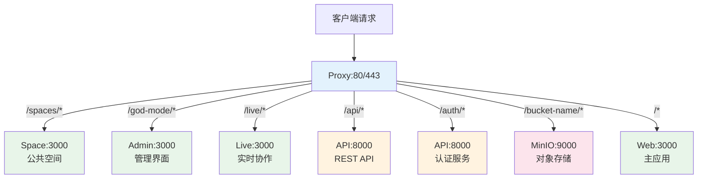
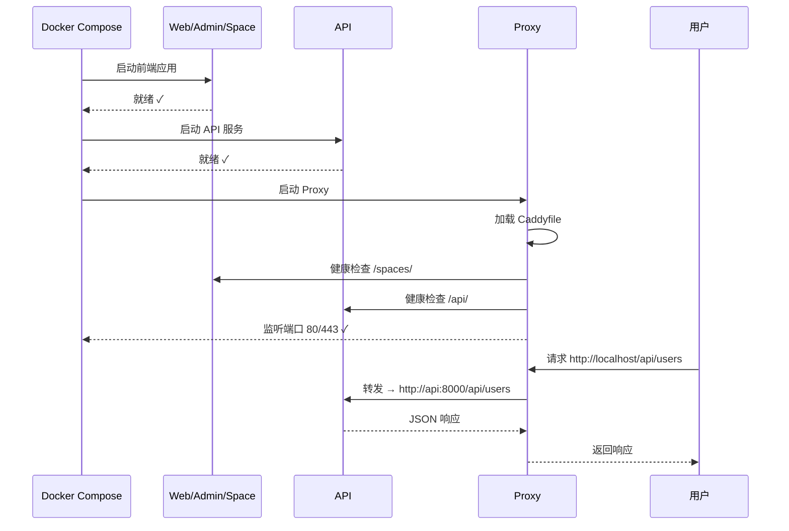

# Proxy 组件技术文档

## 1. 概述

Proxy 组件是 Plane 系统的**统一入口和反向代理层**，负责将外部请求路由到相应的内部服务。基于 **Caddy 2** 实现，提供高性能的 HTTP/HTTPS 反向代理能力。

### 核心职责

- 🚪 **统一入口**：作为系统唯一对外暴露的端口（80/443）
- 🔀 **请求路由**：根据 URL 路径将请求转发到后端服务
- 📦 **文件上传**：处理大文件上传请求（可配置大小限制）
- 🔒 **安全增强**：支持 HTTPS、客户端 IP 识别、可信代理配置

---

## 2. 技术架构

### 2.1 技术栈

| 组件                       | 版本        | 用途                            |
| -------------------------- | ----------- | ------------------------------- |
| **Caddy**                  | 2.10.0      | 核心 Web 服务器和反向代理       |
| **caddy-dns/cloudflare**   | v0.2.1      | Cloudflare DNS 集成（自动 SSL） |
| **caddy-dns/digitalocean** | 特定 commit | DigitalOcean DNS 集成           |
| **mholt/caddy-l4**         | 特定 commit | Layer 4 负载均衡（TCP/UDP）     |

> [!NOTE]
> 使用 `xcaddy` 构建自定义 Caddy 二进制文件，集成 DNS 插件以支持自动 HTTPS 证书获取。

### 2.2 路由架构



### 2.3 路由优先级

路由匹配**从上到下**按照配置顺序执行，**第一个匹配的规则生效**：

| 优先级 | 路径               | 目标服务         | 说明                       |
| ------ | ------------------ | ---------------- | -------------------------- |
| 1      | `/spaces/`         | space:3000       | 公共空间（带尾斜杠重定向） |
| 2      | `/god-mode/`       | admin:3000       | 管理模式（带尾斜杠重定向） |
| 3      | `/live/*`          | live:3000        | 实时协作服务               |
| 4      | `/api/*`           | api:8000         | REST API                   |
| 5      | `/auth/*`          | api:8000         | 认证接口                   |
| 6      | `/{BUCKET_NAME}/*` | plane-minio:9000 | 对象存储访问               |
| 7      | `/*`               | web:3000         | 默认路由（主应用）         |

> [!IMPORTANT]
> `/spaces` 和 `/god-mode` 会自动重定向到带尾斜杠的版本（`/spaces/`、`/god-mode/`），确保路由一致性。

---

## 3. 配置文件详解

### 3.1 Dockerfile.ce

```dockerfile
# 第一阶段: 构建自定义 Caddy
FROM caddy:2.10.0-builder-alpine AS caddy-builder

RUN xcaddy build \
        --with github.com/caddy-dns/cloudflare@v0.2.1 \
        --with github.com/caddy-dns/digitalocean@04bde2867106aa1b44c2f9da41a285fa02e629c5 \
        --with github.com/mholt/caddy-l4@4d3c80e89c5f80438a3e048a410d5543ff5fb9f4

# 第二阶段: 运行镜像
FROM caddy:2.10.0-alpine

RUN apk add --no-cache nss-tools bash curl

COPY --from=caddy-builder /usr/bin/caddy /usr/bin/caddy

COPY Caddyfile.ce /etc/caddy/Caddyfile
```

**关键要点：**

- **多阶段构建**：第一阶段编译插件，第二阶段构建运行镜像（减小镜像体积）
- **系统工具**：安装 `nss-tools`（证书管理）、`bash`、`curl`（调试）
- **自定义二进制**：使用增强版 Caddy 替换官方二进制
- **配置注入**：将 `Caddyfile.ce` 复制到默认配置路径

### 3.2 Caddyfile.ce

#### 全局配置

```caddyfile
{
	servers {
		max_header_size 25MB
		client_ip_headers X-Forwarded-For X-Real-IP
		trusted_proxies static {$TRUSTED_PROXIES:0.0.0.0/0}
	}
}
```

| 配置项              | 说明             | 默认值                     |
| ------------------- | ---------------- | -------------------------- |
| `max_header_size`   | 最大请求头大小   | 25MB                       |
| `client_ip_headers` | 客户端 IP 识别头 | X-Forwarded-For, X-Real-IP |
| `trusted_proxies`   | 可信代理 IP 范围 | 0.0.0.0/0（信任所有）      |

> [!CAUTION]
> `trusted_proxies` 默认信任所有 IP，生产环境应明确指定可信代理范围（如 CDN IP 段）。

#### 路由片段定义

```caddyfile
(plane_proxy) {
	request_body {
		max_size {$FILE_SIZE_LIMIT}
	}

  redir /spaces /spaces/ permanent
	reverse_proxy /spaces/* space:3000

  redir /god-mode /god-mode/ permanent
	reverse_proxy /god-mode/* admin:3000

	reverse_proxy /live/* live:3000
	reverse_proxy /api/* api:8000
	reverse_proxy /auth/* api:8000
	reverse_proxy /{$BUCKET_NAME}/* plane-minio:9000
	reverse_proxy /* web:3000
}
```

**关键配置：**

- `request_body.max_size`：限制请求体大小（防止超大文件耗尽资源）
- `redir ... permanent`：301 永久重定向
- `reverse_proxy`：反向代理指令，格式为 `路径 目标服务`

#### 站点配置

```caddyfile
{$SITE_ADDRESS} {
	import plane_proxy
}
```

- `{$SITE_ADDRESS}`：环境变量，定义监听地址（如 `:80`、`example.com:443`）
- `import plane_proxy`：导入上面定义的路由片段

---

## 4. 环境变量

### 4.1 变量列表

| 变量名                | 用途                     | 默认值        | 示例              |
| --------------------- | ------------------------ | ------------- | ----------------- |
| **FILE_SIZE_LIMIT**   | 请求体最大大小（字节）   | 5242880 (5MB) | `10485760` (10MB) |
| **BUCKET_NAME**       | MinIO 存储桶名称         | uploads       | `plane-uploads`   |
| **SITE_ADDRESS**      | 监听地址                 | `:80`         | `example.com:443` |
| **TRUSTED_PROXIES**   | 可信代理 IP 范围         | 0.0.0.0/0     | `192.168.1.0/24`  |
| **LISTEN_HTTP_PORT**  | HTTP 端口映射（Docker）  | 80            | `8080`            |
| **LISTEN_HTTPS_PORT** | HTTPS 端口映射（Docker） | 443           | `8443`            |

### 4.2 配置位置

环境变量在 **根目录 `.env` 文件** 中配置：

```bash
# Proxy 配置
LISTEN_HTTP_PORT=80
LISTEN_HTTPS_PORT=443
SITE_ADDRESS=:80
FILE_SIZE_LIMIT=5242880
TRUSTED_PROXIES=0.0.0.0/0
```

> [!TIP]
> Proxy 组件支持**运行时环境变量**，修改 `.env` 后只需重启容器即可生效，无需重新构建镜像。

---

## 5. Docker 部署配置

### 5.1 docker-compose.yml 配置

```yaml
proxy:
  container_name: proxy
  build:
    context: ./apps/proxy
    dockerfile: Dockerfile.ce
  restart: always
  ports:
    - ${LISTEN_HTTP_PORT:-80}:80
    - ${LISTEN_HTTPS_PORT:-443}:443
  env_file:
    - .env
  environment:
    FILE_SIZE_LIMIT: ${FILE_SIZE_LIMIT:-5242880}
    BUCKET_NAME: ${AWS_S3_BUCKET_NAME:-uploads}
    SITE_ADDRESS: ${SITE_ADDRESS:-:80}
    TRUSTED_PROXIES: ${TRUSTED_PROXIES:-0.0.0.0/0}
  depends_on:
    - web
    - api
    - space
    - admin
```

**关键配置说明：**

- **端口映射**：宿主机端口 → 容器端口 80/443
- **依赖关系**：确保所有前端和后端服务启动后再启动 Proxy
- **重启策略**：`always`（容器退出后自动重启）

### 5.2 开发模式 vs 生产模式

| 对比项       | 开发模式                                                  | 生产模式              |
| ------------ | --------------------------------------------------------- | --------------------- |
| **启用状态** | ❌ 默认注释（本地直接访问服务）                           | ✅ 启用               |
| **端口暴露** | 各服务独立暴露端口                                        | 仅 Proxy 暴露 80/443  |
| **访问方式** | 直接访问 `localhost:3000`（Web）、`localhost:8000`（API） | 统一通过 `localhost`  |
| **安全性**   | 低（所有端口可访问）                                      | 高（仅 Proxy 可访问） |

---

## 6. 启动流程

### 6.1 容器启动



### 6.2 启动命令

```bash
# 生产模式启动
docker compose up -d proxy

# 查看日志
docker compose logs -f proxy

# 重启服务
docker compose restart proxy
```

---

## 7. 常见维护任务

### 7.1 修改文件上传限制

**场景**：需要支持上传 50MB 的文件

```bash
# 1. 编辑 .env
FILE_SIZE_LIMIT=52428800  # 50MB = 50 * 1024 * 1024

# 2. 重启 Proxy
docker compose restart proxy

# 3. 验证配置
docker compose exec proxy cat /etc/caddy/Caddyfile
```

### 7.2 配置 HTTPS

**场景**：为域名 `plane.example.com` 启用自动 HTTPS

```bash
# 1. 修改 .env
SITE_ADDRESS=plane.example.com

# 2. 重新构建并启动（Caddy 会自动申请证书）
docker compose up -d --build proxy

# 3. 查看证书状态
docker compose exec proxy caddy list-certificates
```

### 7.3 调试路由问题

```bash
# 1. 进入容器
docker compose exec proxy sh

# 2. 测试内部服务连通性
curl http://web:3000
curl http://api:8000/api/health

# 3. 查看 Caddy 运行日志
docker compose logs proxy --tail 100

# 4. 验证 Caddyfile 语法
docker compose exec proxy caddy validate --config /etc/caddy/Caddyfile
```

### 7.4 添加新路由

**场景**：新增 `/metrics` 路径，转发到监控服务 `prometheus:9090`

```bash
# 1. 编辑 apps/proxy/Caddyfile.ce
# 在 (plane_proxy) 片段中添加：
reverse_proxy /metrics/* prometheus:9090

# 2. 重新构建 Proxy 镜像
docker compose up -d --build proxy

# 3. 验证路由
curl http://localhost/metrics
```

> [!NOTE]
> 路由顺序很重要！将新路由添加在 `reverse_proxy /* web:3000` **之前**，否则会被默认路由捕获。

---

## 8. 性能优化建议

### 8.1 启用 HTTP/3

```caddyfile
{$SITE_ADDRESS} {
	protocols h1 h2 h3  # 启用 HTTP/1.1, HTTP/2, HTTP/3
	import plane_proxy
}
```

### 8.2 限制并发连接

```caddyfile
{
	servers {
		max_header_size 25MB
		client_ip_headers X-Forwarded-For X-Real-IP
		trusted_proxies static {$TRUSTED_PROXIES:0.0.0.0/0}
		max_connections 1000  # 限制最大连接数
	}
}
```

### 8.3 启用压缩

```caddyfile
{$SITE_ADDRESS} {
	encode gzip zstd  # 启用 gzip 和 zstd 压缩
	import plane_proxy
}
```

---

## 9. 故障排查

### 9.1 常见问题

| 问题                      | 可能原因        | 解决方案                                    |
| ------------------------- | --------------- | ------------------------------------------- |
| **502 Bad Gateway**       | 后端服务未启动  | 检查 `docker compose ps`，确保目标服务运行  |
| **413 Payload Too Large** | 文件超过限制    | 增加 `FILE_SIZE_LIMIT`                      |
| **404 Not Found**         | 路由配置错误    | 检查 Caddyfile 路由顺序                     |
| **端口被占用**            | 80/443 端口冲突 | 修改 `LISTEN_HTTP_PORT`/`LISTEN_HTTPS_PORT` |

### 9.2 诊断命令

```bash
# 查看容器状态
docker compose ps proxy

# 查看实时日志
docker compose logs -f proxy

# 测试路由
curl -v http://localhost/api/health
curl -v http://localhost/spaces/

# 查看 Caddy 进程
docker compose exec proxy ps aux | grep caddy

# 检查端口监听
docker compose exec proxy netstat -tuln | grep -E '80|443'
```

---

## 10. 安全建议

### 10.1 限制可信代理范围

```bash
# 仅信任 Cloudflare IP 范围（示例）
TRUSTED_PROXIES=173.245.48.0/20,103.21.244.0/22,103.22.200.0/22
```

### 10.2 启用访问日志

```caddyfile
{$SITE_ADDRESS} {
	log {
		output file /var/log/caddy/access.log
		format json
	}
	import plane_proxy
}
```

### 10.3 添加安全头

```caddyfile
{$SITE_ADDRESS} {
	header {
		X-Frame-Options "SAMEORIGIN"
		X-Content-Type-Options "nosniff"
		Referrer-Policy "strict-origin-when-cross-origin"
	}
	import plane_proxy
}
```

---

## 11. 总结

### 核心特点

- ✅ **轻量高效**：基于 Caddy，内存占用低，性能优异
- ✅ **配置简洁**：Caddyfile 语法直观易懂
- ✅ **自动 HTTPS**：集成 DNS 插件，自动申请和续期证书
- ✅ **运行时配置**：环境变量修改后重启即生效，无需重新构建

### 维护要点

1. **路由调整**：修改 `Caddyfile.ce` 后需重新构建镜像
2. **环境变量**：修改 `.env` 后只需重启容器
3. **安全配置**：生产环境必须限制 `TRUSTED_PROXIES` 范围
4. **监控日志**：定期检查 Caddy 日志，及时发现异常

### 相关资源

- **Caddy 官方文档**：[https://caddyserver.com/docs/](https://caddyserver.com/docs/)
- **Caddyfile 语法参考**：[https://caddyserver.com/docs/caddyfile](https://caddyserver.com/docs/caddyfile)
- **反向代理配置**：[https://caddyserver.com/docs/caddyfile/directives/reverse_proxy](https://caddyserver.com/docs/caddyfile/directives/reverse_proxy)
