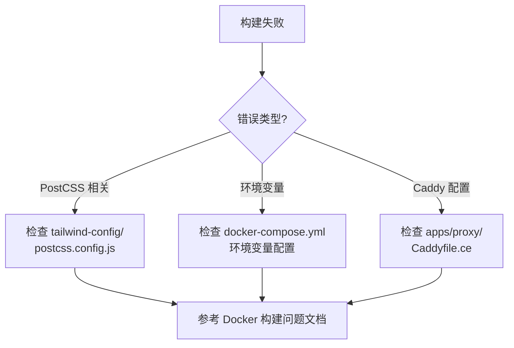
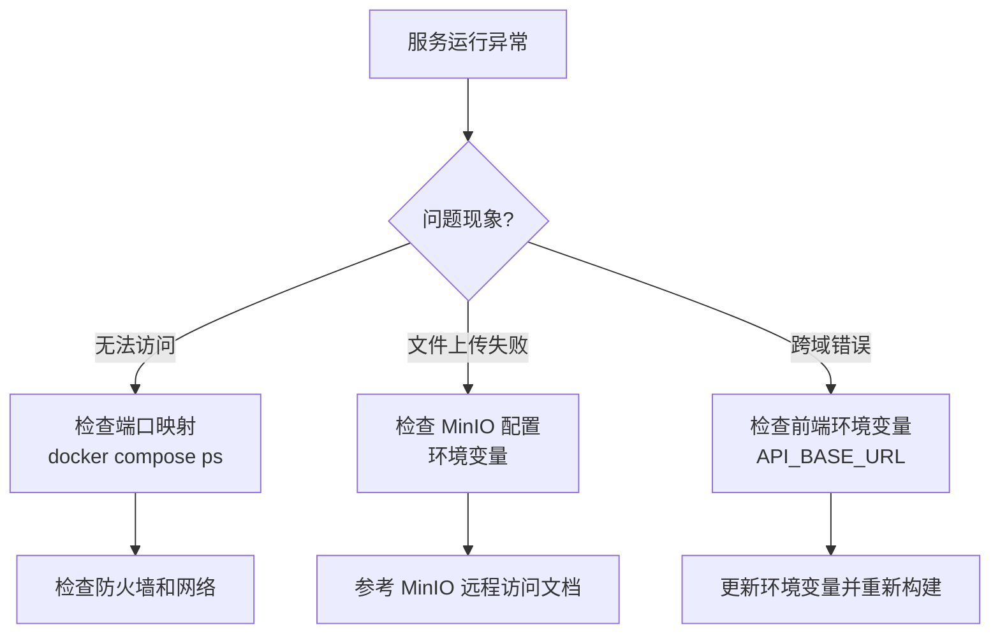

# 故障排查指南

本目录包含 Plane 项目常见问题的详细排查和解决方案。

## 📋 文档列表

- **[Docker 构建问题修复指南](docker-build-issues.md)**
  - Docker Compose 构建失败的完整分析
  - PostCSS 配置问题修复
  - Live 服务环境变量配置
  - Proxy 服务 Caddyfile 配置修复
  - 详细的解决步骤和验证方法

- **[MinIO 远程访问修复](minio-remote-access.md)**
  - 文件上传连接失败问题
  - ERR_CONNECTION_REFUSED 错误分析
  - 环境变量配置修复方案
  - 网络访问验证步骤

## 🔍 问题索引

### 按错误信息查找

| 错误关键词 | 参考文档 | 章节 |
|-----------|---------|------|
| `tailwindcss/nesting` | [Docker 构建问题](docker-build-issues.md) | PostCSS 配置修复 |
| `Invalid environment variables` | [Docker 构建问题](docker-build-issues.md) | Live 服务配置 |
| `server block without any key` | [Docker 构建问题](docker-build-issues.md) | Proxy Caddyfile 修复 |
| `ERR_CONNECTION_REFUSED` | [MinIO 远程访问](minio-remote-access.md) | 问题根源 |
| `localhost:9000` | [MinIO 远程访问](minio-remote-access.md) | MinIO 访问问题 |

### 按服务查找

| 服务 | 常见问题 | 参考文档 |
|-----|---------|---------|
| **Web/Admin/Space** | 构建失败、PostCSS 错误 | [Docker 构建问题](docker-build-issues.md) |
| **Live** | 环境变量配置错误 | [Docker 构建问题](docker-build-issues.md) |
| **Proxy** | Caddyfile 语法错误 | [Docker 构建问题](docker-build-issues.md) |
| **MinIO** | 远程访问失败、文件上传错误 | [MinIO 远程访问](minio-remote-access.md) |

### 按问题类型查找

| 问题类型 | 症状 | 解决方案 |
|---------|------|---------|
| **构建失败** | `docker compose build` 失败 | [Docker 构建问题](docker-build-issues.md) |
| **运行时错误** | 服务启动后出错 | [Docker 构建问题](docker-build-issues.md) |
| **网络问题** | 无法访问服务、跨域错误 | [MinIO 远程访问](minio-remote-access.md) |
| **配置错误** | 环境变量配置不正确 | 两份文档都涉及 |

## 🛠️ 快速诊断流程

### 1. 构建失败

### 2. 运行时问题

## 📝 故障排查清单

### 通用排查步骤

- [ ] 查看服务状态: `docker compose ps`
- [ ] 查看服务日志: `docker compose logs -f [service]`
- [ ] 检查环境变量: `cat .env` 和 `cat apps/*/env`
- [ ] 验证端口映射: `docker compose port [service]`
- [ ] 检查网络连接: `docker network ls`

### Docker 构建问题

- [ ] 清理构建缓存: `docker compose build --no-cache`
- [ ] 检查 PostCSS 配置
- [ ] 验证环境变量完整性
- [ ] 检查 Caddyfile 语法

### MinIO 访问问题

- [ ] 检查 `USE_MINIO` 环境变量
- [ ] 验证 `AWS_S3_ENDPOINT_URL` 配置
- [ ] 测试网络连通性
- [ ] 检查防火墙规则

## 📚 相关文档

- [部署指南](19_repo_doc_ref/plane/03-guides/deployment/deployment-guide.md) - 避免部署中的常见问题
- [环境变量配置说明](environment-variables.md) - 完整的环境变量参考
- [Docker 快速参考](docker-quick-reference.md) - Docker 常用命令

## 💡 最佳实践

- ✅ **构建前检查**: 确保所有配置文件语法正确
- ✅ **环境变量验证**: 使用 `docker compose config` 验证配置
- ✅ **日志记录**: 保存完整的错误日志便于分析
- ✅ **增量调试**: 一次只修改一个配置，便于定位问题
- ✅ **文档更新**: 遇到新问题及时更新文档

## 🔄 文档更新

| 日期 | 更新内容 |
|------|---------|
| 2025-12-30 | 创建故障排查目录，整理 Docker 构建和 MinIO 访问问题文档 |

---

**文档维护**: DevOps Team
**最后更新**: 2025-12-30
