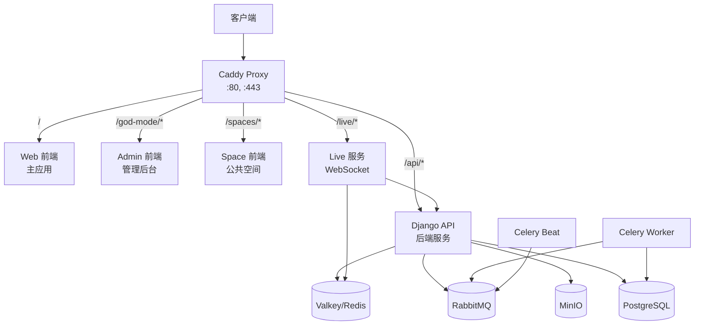

# Docker Compose 构建问题修复指南

> [!info] 文档说明
> 本文档记录了 Plane 项目在 Docker Compose 构建过程中遇到的问题及完整解决方案，供后续开发人员参考。

## 📋 问题概述

在执行 `docker compose -f docker-compose.yml up -d` 时，admin 服务构建失败，错误信息：

```
target admin: failed to solve: process "/bin/sh -c pnpm turbo run build --filter=admin" did not complete successfully: exit code: 1
```

## 🔍 问题分析

### 主要问题点

通过逐步调试，发现了以下三个关键问题：

1. **PostCSS 配置问题** - Tailwind CSS nesting 插件缺失
2. **Live 服务环境变量缺失** - 缺少必需的配置
3. **Proxy 服务 Caddyfile 配置错误** - 全局配置块位置不正确

---

## 🛠️ 解决方案

### 1. PostCSS 配置修复

#### 问题详情

**错误信息：**
```
[vite:css] Failed to load PostCSS config (searchPath: /app/apps/admin):
[Error] Loading PostCSS Plugin failed: Cannot find module 'tailwindcss/nesting'
```

**根本原因：**
- PostCSS 配置文件引用了 `tailwindcss/nesting` 插件
- Docker 构建环境中 pnpm workspace 依赖解析问题
- Web 和 Space 应用误安装了 Tailwind CSS v4，配置却是 v3

#### 解决步骤

**步骤 1：修改 PostCSS 配置**

文件：`packages/tailwind-config/postcss.config.js`

```diff
  module.exports = {
    plugins: {
-     "tailwindcss/nesting": {},
      tailwindcss: {},
      autoprefixer: {},
    },
  };
```

> [!tip] 为什么移除 nesting 插件？
> Tailwind CSS v3.4+ 已内置支持 CSS nesting，无需单独的插件。

**步骤 2：添加 PostCSS 依赖到应用**

```bash
# Admin 应用
pnpm add tailwindcss autoprefixer postcss --filter=admin -D

# Web 应用
pnpm add tailwindcss@^3.4.18 autoprefixer postcss --filter=web -D

# Space 应用
pnpm add tailwindcss@^3.4.18 autoprefixer postcss --filter=space -D
```

> [!warning] 版本注意
> 必须使用 Tailwind CSS v3.4.x，不要使用 v4.x，因为项目配置基于 v3。

**相关文件：**
- `apps/admin/package.json`
- `apps/web/package.json`
- `apps/space/package.json`

---

### 2. Live 服务环境变量配置

#### 问题详情

**错误信息：**
```
❌ Invalid environment variables: {
    "API_BASE_URL": {
        "_errors": ["Required"]
    },
    "LIVE_SERVER_SECRET_KEY": {
        "_errors": ["Required"]
    }
}
```

**根本原因：**
Live 服务使用了环境变量验证（通过 Zod 或类似工具），但 docker-compose.yml 中未配置这些变量。

#### 解决步骤

**修改文件：** `docker-compose.yml`

```yaml
live:
  container_name: plane-live
  build:
    context: .
    dockerfile: ./apps/live/Dockerfile.live
    args:
      DOCKER_BUILDKIT: 1
  restart: always
  environment:
    API_BASE_URL: http://api:8000
    LIVE_SERVER_SECRET_KEY: ${LIVE_SERVER_SECRET_KEY:-secret-key}
    REDIS_URL: redis://plane-redis:6379/
    REDIS_HOST: plane-redis
    REDIS_PORT: 6379
    PORT: 3000
  depends_on:
    - api
    - plane-redis
```

> [!info] 环境变量说明
> - `API_BASE_URL`: Live 服务调用后端 API 的地址
> - `LIVE_SERVER_SECRET_KEY`: WebSocket 服务的密钥
> - `REDIS_URL`: Redis 连接字符串
> - Docker 内部使用服务名作为 hostname

---

### 3. Proxy 服务 Caddyfile 修复

#### 问题详情

**错误信息：**
```
Error: adapting config using caddyfile: server block without any key is global configuration, and if used, it must be first
```

**根本原因：**
1. Caddyfile 的全局配置块必须放在文件最开头
2. 环境变量 `CERT_EMAIL` 和 `CERT_ACME_DNS` 为空，导致语法错误
3. 缺少 `SITE_ADDRESS` 和 `TRUSTED_PROXIES` 环境变量

#### 解决步骤

**步骤 1：修复 Caddyfile 结构**

文件：`apps/proxy/Caddyfile.ce`

```caddyfile
# 全局配置块必须在最前面
{
	servers {
		max_header_size 25MB
		client_ip_headers X-Forwarded-For X-Real-IP
		trusted_proxies static {$TRUSTED_PROXIES:0.0.0.0/0}
	}
}

# 自定义片段
(plane_proxy) {
	request_body {
		max_size {$FILE_SIZE_LIMIT}
	}

	redir /spaces /spaces/ permanent
	reverse_proxy /spaces/* space:3000

	redir /god-mode /god-mode/ permanent
	reverse_proxy /god-mode/* admin:3000

	reverse_proxy /live/* live:3000

	reverse_proxy /api/* api:8000

	reverse_proxy /auth/* api:8000

	reverse_proxy /{$BUCKET_NAME}/* plane-minio:9000

	reverse_proxy /* web:3000
}

# 站点配置
{$SITE_ADDRESS} {
	import plane_proxy
}
```

> [!warning] Caddyfile 语法规则
> - 全局配置块 `{}` 必须在文件开头
> - 空的环境变量会导致解析错误
> - 使用 `{$VAR:default}` 提供默认值

**步骤 2：添加环境变量到 docker-compose.yml**

```yaml
proxy:
  container_name: proxy
  build:
    context: ./apps/proxy
    dockerfile: Dockerfile.ce
  restart: always
  ports:
    - ${LISTEN_HTTP_PORT}:80
    - ${LISTEN_HTTPS_PORT}:443
  environment:
    FILE_SIZE_LIMIT: ${FILE_SIZE_LIMIT:-5242880}
    BUCKET_NAME: ${AWS_S3_BUCKET_NAME:-uploads}
    SITE_ADDRESS: ${SITE_ADDRESS:-:80}
    TRUSTED_PROXIES: ${TRUSTED_PROXIES:-0.0.0.0/0}
  depends_on:
    - web
    - api
    - space
    - admin
```

---

## 📦 完整构建流程

### 快速开始

```bash
# 1. 确保环境变量配置正确
cp .env.example .env
cp apps/api/.env.example apps/api/.env
cp apps/admin/.env.example apps/admin/.env
cp apps/web/.env.example apps/web/.env
cp apps/live/.env.example apps/live/.env

# 2. 构建所有服务
docker compose -f docker-compose.yml build

# 3. 启动所有服务
docker compose -f docker-compose.yml up -d

# 4. 查看服务状态
docker compose -f docker-compose.yml ps
```

### 验证服务

```bash
# 检查所有容器状态
docker compose ps

# 测试主应用访问
curl -I http://localhost:80/

# 测试管理后台
curl -I http://localhost:80/god-mode/

# 测试 Space 应用
curl -I http://localhost:80/spaces/

# 查看特定服务日志
docker logs proxy
docker logs api
docker logs plane-live
```

---

## 🎯 服务架构



---

## 📊 服务端口映射

| 服务 | 内部端口 | 外部端口 | 说明 |
|------|----------|----------|------|
| proxy | 80, 443 | 80, 443 | Caddy 反向代理 |
| web | 3000 | - | Web 前端（通过 proxy） |
| admin | 3000 | - | Admin 前端（通过 proxy） |
| space | 3000 | - | Space 前端（通过 proxy） |
| api | 8000 | - | Django API |
| live | 3000 | - | WebSocket 服务 |
| plane-db | 5432 | - | PostgreSQL |
| plane-redis | 6379 | - | Redis/Valkey |
| plane-minio | 9000 | - | MinIO 对象存储 |

---

## 🔧 故障排查

### 常见问题

#### 1. 服务无法启动

**检查日志：**
```bash
# 查看所有服务日志
docker compose logs

# 查看特定服务日志
docker logs <container-name> --tail 50
```

**常见原因：**
- 环境变量未配置
- 端口冲突
- 依赖服务未就绪

#### 2. Proxy 持续重启

**诊断命令：**
```bash
# 验证 Caddyfile 配置
docker run --rm \
  -e TRUSTED_PROXIES="0.0.0.0/0" \
  -e FILE_SIZE_LIMIT="5242880" \
  -e BUCKET_NAME="uploads" \
  -e SITE_ADDRESS=":80" \
  plane-proxy caddy validate --config /etc/caddy/Caddyfile
```

**解决方案：**
- 确保所有环境变量已设置
- 检查 Caddyfile 语法

#### 3. 前端构建失败

**检查 PostCSS 配置：**
```bash
# 查看构建日志
docker compose build admin 2>&1 | grep -i "error\|failed"
```

**解决方案：**
- 确保 PostCSS 相关依赖已安装
- 验证 Tailwind CSS 版本为 v3.4.x

#### 4. Live 服务环境变量错误

**检查环境变量：**
```bash
docker inspect plane-live | jq '.[0].Config.Env'
```

**必需的环境变量：**
- `API_BASE_URL`
- `LIVE_SERVER_SECRET_KEY`
- `REDIS_URL` 或 `REDIS_HOST` + `REDIS_PORT`

---

## 📝 配置清单

### 必需的 .env 文件

- [ ] `/opt/code/plane/.env` - 主配置文件
- [ ] `/opt/code/plane/apps/api/.env` - API 配置
- [ ] `/opt/code/plane/apps/admin/.env` - Admin 配置
- [ ] `/opt/code/plane/apps/web/.env` - Web 配置
- [ ] `/opt/code/plane/apps/live/.env` - Live 配置

### 关键环境变量

**主 .env 文件：**
```env
# 数据库
POSTGRES_USER=plane
POSTGRES_PASSWORD=plane
POSTGRES_DB=plane

# Redis
REDIS_HOST=plane-redis
REDIS_PORT=6379

# 对象存储
AWS_ACCESS_KEY_ID=access-key
AWS_SECRET_ACCESS_KEY=secret-key
AWS_S3_BUCKET_NAME=uploads

# 代理设置
SITE_ADDRESS=:80
TRUSTED_PROXIES=0.0.0.0/0
FILE_SIZE_LIMIT=5242880
```

**Live .env 文件：**
```env
API_BASE_URL=http://localhost:8000
LIVE_SERVER_SECRET_KEY=secret-key
REDIS_URL=redis://localhost:6379/
```

---

## 🚀 优化建议

### 开发环境

1. **使用开发版 Dockerfile**
   ```bash
   # 使用开发配置启动
   docker compose -f docker-compose-local.yml up
   ```

2. **启用 pnpm 缓存**
   - Docker 构建已配置 pnpm store 缓存
   - 减少重复下载依赖

3. **并行构建**
   ```bash
   # 利用多核 CPU 加速构建
   docker compose build --parallel
   ```

### 生产环境

1. **资源限制**
   ```yaml
   services:
     api:
       deploy:
         resources:
           limits:
             cpus: '2'
             memory: 2G
           reservations:
             memory: 1G
   ```

2. **健康检查**
   - 所有前端服务已配置 HEALTHCHECK
   - API 服务建议添加健康检查端点

3. **日志管理**
   ```yaml
   services:
     api:
       logging:
         driver: "json-file"
         options:
           max-size: "10m"
           max-file: "3"
   ```

---

## 📚 相关资源

### 官方文档

- [[Plane Documentation|Plane 官方文档]]
- [[Docker Compose Reference|Docker Compose 参考]]
- [[Caddy Documentation|Caddy 文档]]
- [[Tailwind CSS v3|Tailwind CSS 文档]]

### 内部链接

- [[项目架构说明]]
- [[开发环境配置]]
- [[部署流程]]
- [[环境变量配置清单]]

### 外部链接

- [pnpm Workspace](https://pnpm.io/workspaces)
- [Vite 配置](https://vitejs.dev/config/)
- [React Router v7](https://reactrouter.com/)
- [Caddyfile 语法](https://caddyserver.com/docs/caddyfile)

---

## 🔄 版本历史

| 日期 | 版本 | 变更说明 | 作者 |
|------|------|----------|------|
| 2025-12-12 | 1.0 | 初始版本，记录 Docker 构建问题修复 | Claude |

---

## ⚠️ 注意事项

> [!warning] 重要提醒
> 1. **不要直接修改 node_modules** - 始终通过 package.json 管理依赖
> 2. **环境变量敏感信息** - 生产环境请使用 secrets 管理
> 3. **数据持久化** - 确保 volumes 配置正确，避免数据丢失
> 4. **端口冲突** - 启动前检查 80、443 端口是否被占用
> 5. **内存要求** - 建议至少 12GB RAM，8GB 可能导致构建失败

> [!tip] 最佳实践
> - 定期备份数据库和 volumes
> - 使用 `.env.example` 作为模板创建 `.env`
> - 开发环境使用 `docker-compose-local.yml`
> - 生产环境配置 HTTPS 证书
> - 监控日志文件大小，避免磁盘占满

---

## 🤝 贡献

如果您发现文档有误或需要补充，请：

1. 创建 Issue 说明问题
2. 提交 PR 更新文档
3. 遵循项目代码规范

---

**文档维护：** DevOps Team
**最后更新：** 2025-12-12
**状态：** ✅ 已验证

#docker #troubleshooting #plane #deployment
